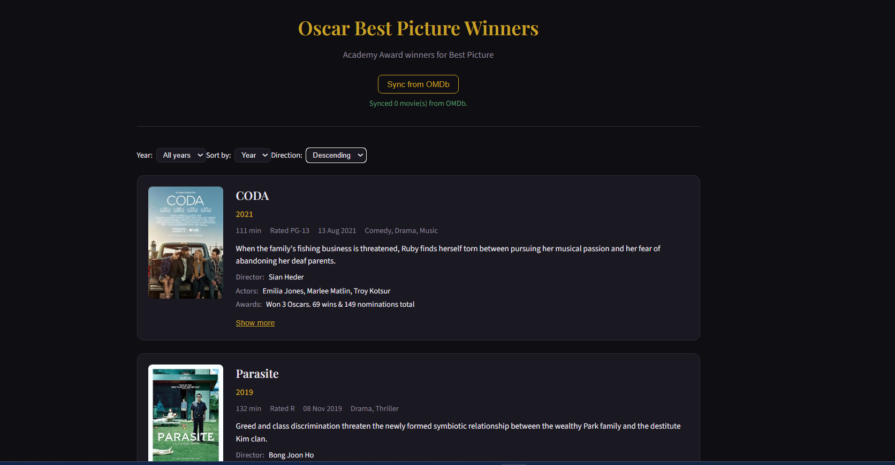

# Oscar Winners Web Application

A full-stack app that lists **Academy Award Best Picture winners**, with data cached from the [OMDb API](https://www.omdbapi.com/).

- **Backend**: Java 17, Spring Boot 3.x, SQLite, Spring Data JPA  
- **Frontend**: React 18, Vite  
- **Data**: Curated list of Best Picture winners (title + year) in SQLite; full details (poster, plot, cast, etc.) are fetched from OMDb and cached.

---

## 1. Get an OMDb API key

1. Go to [https://www.omdbapi.com/apikey.aspx](https://www.omdbapi.com/apikey.aspx).
2. Request a **free** API key (e.g. “Personal” or “1,000 requests/day”).
3. Copy the key. You will pass it to the backend via an environment variable (do **not** commit it).

---

## 2. Run the backend

**Requirements**: Java 17+, Maven.

```bash
cd backend
```

Set your OMDb API key (replace `YOUR_OMDB_KEY` with your real key):

- **Windows (PowerShell)**  
  `$env:OMDB_API_KEY="YOUR_OMDB_KEY"`

- **Windows (CMD)**  
  `set OMDB_API_KEY=YOUR_OMDB_KEY`

- **macOS / Linux**  
  `export OMDB_API_KEY=YOUR_OMDB_KEY`

Then start the server:

```bash
mvn spring-boot:run
```

The API will be at **http://localhost:8080**. A SQLite database file `oscar.db` is created in the current working directory (e.g. `backend/` if you run from there).

**Endpoints:**

- `GET /api/movies` — list all Oscar winners (from SQLite).
- `GET /api/movies/{id}` — single movie by database id.
- `POST /api/movies/sync` — fetch/cache missing movie details from OMDb (by title/year or `imdbID`).

---

## 3. Run the frontend

**Requirements**: Node.js 18+, npm.

```bash
cd frontend
npm install
npm run dev
```

The app will be at **http://localhost:5173**. In development, Vite proxies `/api` to `http://localhost:8080`, so the frontend talks to your backend without extra config.

**Optional**: To point at another backend URL, set:

- `VITE_API_URL=http://localhost:8080` (or your backend URL) in a `.env` file or environment before `npm run dev`.

---

## 4. Using the app

1. Open **http://localhost:5173**.
2. You’ll see the list of Best Picture winners (title and year from the built-in seed list). If OMDb data hasn’t been synced yet, posters and details may be missing.
3. Click **“Sync from OMDb”** to fetch and cache full details (poster, plot, director, actors, genre, awards, etc.) for all movies that haven’t been synced yet.
4. After sync, the list shows all available data; use **“Show more”** on a movie for language, country, and Metascore.

---

## 5. Project layout

```
backend/          # Spring Boot app
  src/main/java/  # Application, entity, repository, OMDb service, REST controller
  src/main/resources/
    application.properties  # SQLite URL, JPA, omdb.api.key placeholder
frontend/         # Vite + React
  src/
    App.jsx       # Main app, fetches /api/movies, loading/error states
    components/   # MovieList, MovieCard, SyncButton
  index.html
  vite.config.js # Dev proxy /api -> backend
README.md         # This file
```

---

## 6. Notes

- **API key**: Never commit your OMDb API key. Use `OMDB_API_KEY` (or a local override) as above.
- **Rate limits**: The free OMDb tier has daily limits. The app caches results in SQLite and only syncs when you call `POST /api/movies/sync` (or when you add a sync-on-startup option), so repeated page loads do not hit OMDb.
- **Database**: SQLite file path is set in `application.properties` (`spring.datasource.url`). Default is `jdbc:sqlite:${user.dir}/oscar.db`.


## Final Look

